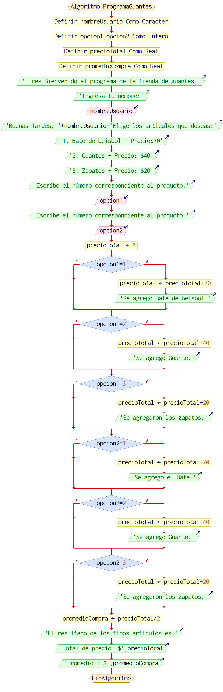

# Ejercicio base beisbol
En su labor como programador de software, ha sido seleccionado para desarrollar una aplicación de venta de artículos de béisbol. La aplicación debe permitir registrar la información básica de cada cliente, nombre y los artículos adquiridos. Además, se debe calcular el total de la compra para cada cliente.

Aclaraciones:

La aplicación se centra en la venta de artículos de béisbol.
Se necesitará que se enumere el tipo de implemento de beisbol que se vaya a comprar.
Se aclara un mensaje en el que diga qué tipo de implemento de beisbol fue comprado y el precio del implemento.
# Analisis del ejercicio

# Aproximandion de caso de uso
Nombre del caso de uso: Selección de implementos de basquetbol

Actores: Usuario

Propósito: Permitir al usuario seleccionar los implementos de basquetbol que desea comprar y conocer el precio total de la compra y el promedio de compra por implemento.

Curso normal de eventos:

El usuario inicia el programa.
El programa solicita al usuario que ingrese su nombre.
El usuario ingresa su nombre.
El programa muestra un menú con los implementos disponibles y sus precios.
El usuario selecciona los implementos que desea adquirir
El programa calcula el precio total de la compra.
El programa muestra al usuario el precio total de la compra.

# Diagrama Caso de uso

 # Aproximación Seudocódigo:

 Inicio

Ingresar nombre del comprador

Mostrar "Seleccione los artículos de béisbol (separados por coma):

Mostrar artículos de béisbol disponibles

Ingresar números de los artículos seleccionados

Definir total como 0

Definir productos Elegidos como una lista vacía
para cada número en los artículos seleccionados

Obtener el artículo correspondiente al número

Sumar el precio del artículo al total

Agregar el artículo a la lista de productos elegidos

Mostrar nombre del comprador

Mostrar productos elegidos

Mostrar total a pagar

Fin

# Diagrama de flujo

# Historia De Usuario

